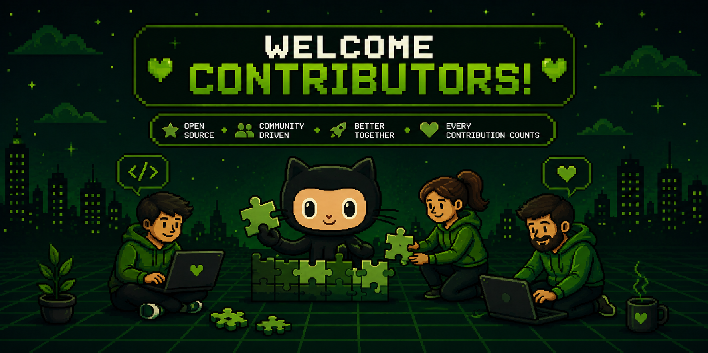

# Contributing

First of all, thank you for considering contributing to Fakement! 💚

Fakement is an open-source project whose goal is to provide a local-first payment gateway for developers to build, test, and debug payment integrations without relying on external providers or unstable sandbox environments.

Every contribution is appreciated, whether it is fixing a bug, improving the documentation, implementing a feature, or simply suggesting an idea.

## Project Philosophy

Fakement is designed around a few core principles:

- **Local-first** — Everything should run entirely on the developer's machine.
- **Developer Experience** — APIs should be simple, predictable, and pleasant to use.
- **Realistic Behavior** — Simulate real payment gateway workflows without unnecessary complexity.
- **Deterministic** — The same input should always produce the same output whenever possible.
- **Open Source** — The project is built for the community and welcomes contributions.

When contributing, please keep these principles in mind.

## Getting Started

To set up your local development environment, follow the instructions in the project's README.

See the **Installation** section:

> [README.md → Installation](./README.md#installation)

After the project is running, you can start implementing your changes.

## Ways to Contribute

There are many ways to contribute:

- Report bugs
- Improve the documentation
- Improve the dashboard UI
- Fix existing issues
- Add new payment simulations
- Implement new payment methods
- Improve webhook behavior
- Improve developer experience
- Refactor existing code
- Add automated tests
- Suggest new features

Even small improvements make a difference.

## Before Opening an Issue

Before creating a new Issue, please:

- Search existing Issues to avoid duplicates.
- Make sure the behavior isn't already documented.
- Clearly explain the problem or feature request.
- Include as much context as possible.

Feature discussions are always welcome.

## Before Opening a Pull Request

Please make sure that:

- Your changes solve a single problem.
- The project builds successfully.
- Existing functionality continues to work.
- New code follows the existing architecture.
- Documentation has been updated when necessary.

Small and focused Pull Requests are much easier to review than very large ones.

## Coding Guidelines

Please follow the current coding style throughout the project.

### General

- Use TypeScript.
- Prefer explicit types.
- Keep functions small and focused.
- Avoid unnecessary abstractions.
- Write readable code before clever code.

### Validation

- Validate all external input using Zod.
- Never trust request payloads.

### Business Logic

- Keep business logic inside services.
- Controllers should only orchestrate requests and responses.
- Avoid mixing HTTP concerns with domain logic.

### Database

- Use Prisma for all database operations.
- Keep migrations small and descriptive.
- Prefer explicit relations over complex queries whenever possible.

### Commits

Use **Conventional Commits** whenever possible.

Examples:

```text
feat: add subscription simulation

fix: prevent duplicated webhook deliveries

docs: improve installation guide

refactor: simplify payment service
```

Reference:

https://www.conventionalcommits.org

## Code Style

Before submitting your Pull Request, make sure the project is properly formatted and linted.

Consistency is more important than personal preference.

## Testing

Whenever possible:

- Test your feature locally.
- Ensure existing behavior has not been broken.
- Add tests for new functionality whenever it makes sense.

## Documentation

Documentation is just as important as code.

If your Pull Request introduces:

- a new endpoint,
- a new feature,
- a new configuration,
- or changes existing behavior,

please update the relevant documentation.

## Reporting Bugs

When reporting a bug, please include:

- Operating system
- Node.js version
- Steps to reproduce
- Expected behavior
- Actual behavior
- Relevant logs
- Screenshots (if applicable)

The more information you provide, the easier it is to reproduce and fix the issue.

## Feature Requests

One of Fakement's goals is to simulate the behavior of real-world payment gateways while remaining lightweight and easy to understand.

If you have ideas that improve the developer experience without making the project unnecessarily complex, we'd love to hear them.

Open an Issue describing:

- the problem you're trying to solve;
- your proposed solution;
- possible alternatives.

Discussion is encouraged before implementation.

## Questions

If you're unsure about an implementation or architectural decision, feel free to open a Discussion or an Issue before starting development.

We're happy to help.

## Thank You 💚

Open source only exists because people choose to contribute.

Whether you're fixing a typo, reporting a bug, improving documentation, or implementing a major feature, your contribution helps make Fakement better for developers everywhere.

Thank you for being part of the project. 🚀
