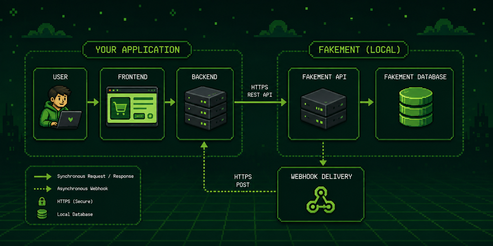
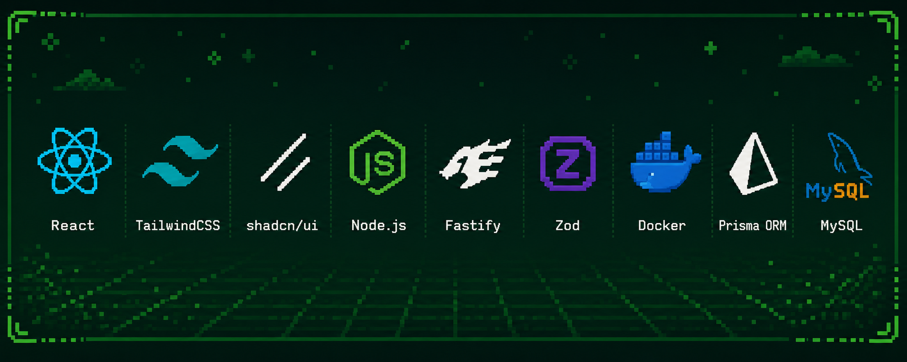

# Fakement

> A local-first fake payment gateway for developing and testing payment integrations.

Fakement is an open-source REST API that simulates the behavior of a payment gateway, allowing developers to build and test payment integrations without relying on external providers, internet connectivity, or sandbox environments.

Inspired by tools like Mailcatcher, Fakement provides a predictable and fully local environment for simulating payment flows, webhooks, and transaction lifecycles.

## Motivation

Integrating with payment providers during development can be slow and frustrating.

- Requires API keys
- Depends on internet connectivity
- Sandbox environments are often unstable
- Different providers expose different APIs
- Difficult to reproduce edge cases

Fakement solves these problems by providing a local payment gateway that behaves like a real one.

## Architecture



Fakement is designed to fit into your existing application like a real payment provider. Instead of communicating with Stripe, Mercado Pago, Adyen, or another external gateway, your backend sends payment requests to a local Fakement instance.

The flow is straightforward:

1. The user initiates a payment from your application.
2. Your frontend sends the request to your backend.
3. Your backend calls the Fakement REST API.
4. Fakement simulates the payment lifecycle and stores the transaction locally.
5. If configured, Fakement sends webhook events back to your application, allowing you to test asynchronous payment flows exactly as they would happen in production.

Because everything runs locally, developers can build, debug, and reproduce payment scenarios without internet connectivity, sandbox accounts, or third-party dependencies.

## Tech Stack



| Technology       | Why it's used                                                                                                           |
| ---------------- | ----------------------------------------------------------------------------------------------------------------------- |
| **React**        | Powers the dashboard used to manage API keys, inspect payments, configure webhooks, and monitor simulated transactions. |
| **Tailwind CSS** | Utility-first CSS framework used to build a modern, responsive, and maintainable interface.                             |
| **shadcn/ui**    | Provides accessible, reusable UI components built on Radix UI, enabling a consistent developer experience.              |
| **Node.js**      | JavaScript runtime that powers the Fakement backend and its high-performance REST API.                                  |
| **Fastify**      | Fast and lightweight web framework responsible for routing, validation, plugins, and HTTP handling.                     |
| **Zod**          | Runtime schema validation and TypeScript type inference for requests, responses, configuration and UI forms.            |
| **Docker**       | Makes Fakement easy to run locally with a consistent environment across operating systems.                              |
| **Prisma ORM**   | Type-safe ORM used for database access, migrations, and data modeling.                                                  |
| **MySQL**        | Stores payments, API keys, webhook configurations, events, and other persistent application data.                       |

## Installation

### Prerequisites

Before getting started, make sure you have the following installed:

- **Node.js** 22 or later
- **pnpm** 10+
- **Docker** and Docker Compose
- **Git**

### Clone the repository

```bash
git clone https://github.com/arthurmousinho/fakement.git
cd fakement
```

### Install dependencies

```bash
pnpm install
```

### Start the database

```bash
docker compose up -d
```

### Configure the environment

Copy the example environment file:

```bash
cp .env.example .env
```

Update the variables if necessary.

### Run database migrations

```bash
pnpm prisma migrate dev
```

### Start the development server

```bash
pnpm dev
```

Once the server is running, the API will be available at:

```text
http://localhost:8080
```

And the web UI will be available at:

```text
http://localhost:5173
```
